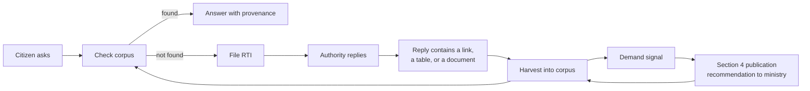
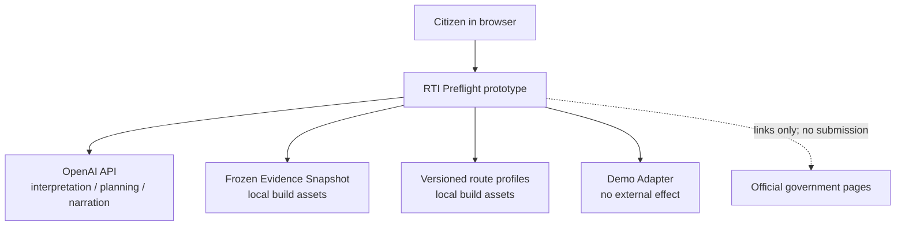
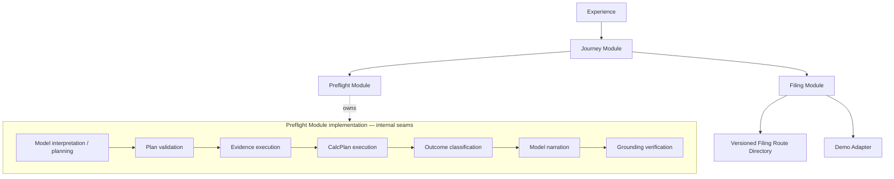
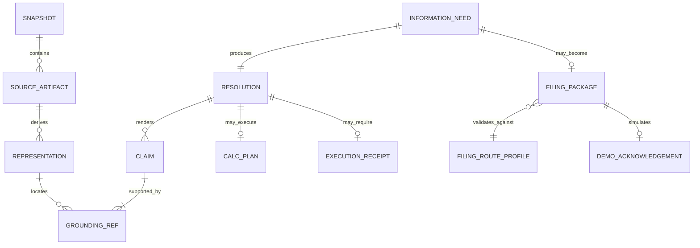
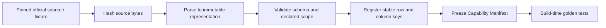
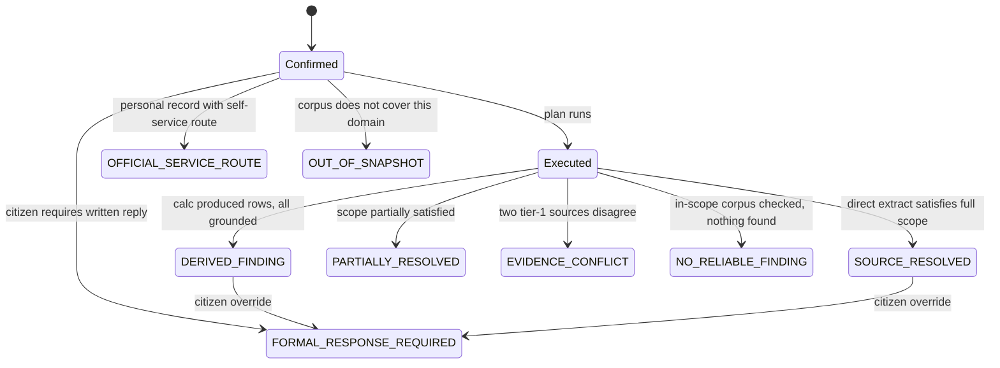
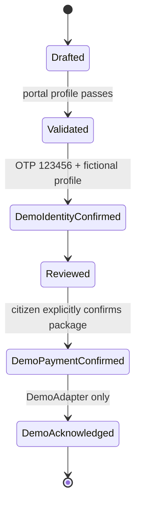
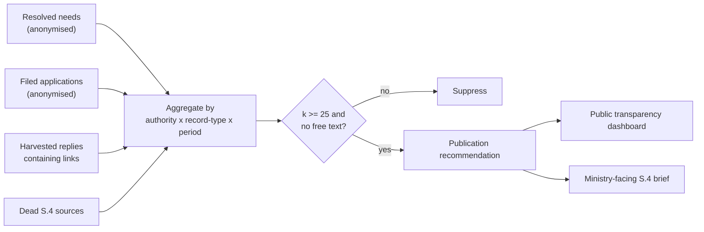

# RTI Preflight — Full Technical Architecture

**Scope:** the two-week, mock-data hackathon prototype. Sections explicitly marked “future hypothesis” are non-binding possibilities, not P0 commitments.
**Status:** architecture of record for P0 only. The deployed prototype is taken down after two weeks and sends no request, payment, OTP, or applicant identity to a government system.
**Companion doc:** [`RTI-PREFLIGHT-PROTOTYPE-SPEC.md`](./RTI-PREFLIGHT-PROTOTYPE-SPEC.md) is the citizen journey and acceptance specification.

---

## 1. System purpose and boundaries

### 1.1 What the system does

Resolves a citizen's need for information held by an Indian public authority through the least burdensome valid route and, when a formal request is genuinely required, prepares and validates a Filing Package before completing an explicitly simulated filing journey.

P0 ends at Demo Submission and fictional acknowledgement. Real filing, tracking, response ingestion, and appeals are outside the prototype.

### 1.2 Future hypothesis: the evidence flywheel

This is a plausible future extension, not a P0 dependency. It requires separate product, legal, privacy, and operational validation before implementation.



An RTI response that points to an existing page can be a **discoverability signal**: the information may be public yet difficult for citizens to find. A future, consented and reviewed ingestion workflow could use such signals to improve the evidence corpus and reduce some avoidable filings. It must not label every linked response a statutory failure, promise that future citizens will never file, or enter P0 disguised as working functionality.

### 1.3 Hard invariants

These are binding for every P0 path and test environment.

| # | Invariant |
|---|---|
| I1 | A language model never originates a fact, figure, date, name, or URL that reaches a citizen. |
| I2 | Every factual claim resolves to an immutable source blob, an immutable derived representation, and a locator whose located content is independently hash-verifiable. |
| I3 | Every derived claim exposes its operands, its operation, and the plan that produced it, in citizen-readable form. |
| I4 | Absence from the corpus is never rendered as absence from the public record. |
| I5 | The option to file a formal request is never removed, hidden, or discouraged. |
| I6 | Retrieved content and citizen input are data, never instructions. |
| I7 | Research is anonymous. Identity is collected only at the filing boundary and never crosses back into retrieval. |
| I8 | The P0 Evidence Snapshot is content-addressed and immutable for the life of the two-week deployment, then deleted with the deployment. Long-term archival is a future policy decision. |
| I9 | Every constraint asserted about an external portal is versioned, dated, and backed by a conformance test. |
| I10 | The system never predicts, promises, or implies what an authority will disclose. |

### 1.4 Context



### 1.5 Explicit non-boundaries

The P0 system does **not**: authenticate a citizen to a government identity system; accept real applicant, payment, or identity data; store Aadhaar, PAN, or EPIC; act as the authority of record for government data; submit to a live portal; represent a citizen before an Information Commission; track or appeal a filing; or guarantee disclosure.

---

## 2. Logical architecture

The external architecture has three deep Modules. Intelligence, Evidence, Determinism, and Trust are internal capabilities, not independently callable application layers.



### 2.1 Preflight Module Interface

```ts
interface PreflightModule {
  interpret(input: RedactedCitizenText): Promise<NeedInterpretation>;
  resolve(input: {
    need: ConfirmedInformationNeed;
    snapshot: SnapshotRef;
  }): Promise<RenderableResolution>;
}
```

`RenderableResolution` is opaque outside the Module and can be constructed only after deterministic outcome classification and grounding verification. The Journey Module cannot call model narration, evidence lookup, calculation, or grounding verification independently, so it cannot accidentally skip or reorder the trust sequence.

### 2.2 Filing Module Interface

```ts
interface FilingModule {
  prepare(input: {
    need: ConfirmedInformationNeed;
    holder: InformationHolderRef;
    route: FilingRouteRef;
  }): Promise<ValidatedFilingPackage>;

  demoSubmit(input: CitizenConfirmed<ValidatedFilingPackage>): Promise<DemoAcknowledgement>;
}
```

The P0 Filing Module has a Demo Adapter and a test adapter, making the filing seam real without implying a live government integration.

### 2.3 Intelligence/Evidence rule

Intelligence has **no unmediated corpus access**. The model emits a typed plan; the Preflight Module validates and executes it against the Evidence Snapshot. The model receives only the validated execution result and cited excerpts as fenced, untrusted data for narration. A model can neither choose arbitrary corpus content nor return a citizen-visible result without the Module's grounding gate.

---

## 3. Technology selections

### 3.1 Binding P0 selections

| Concern | P0 selection | Reason |
|---|---|---|
| Web and server | One Next.js App Router + TypeScript deployment | One language and deployment; SSR for the public browser experience; no separate server tier to operate overnight |
| Evidence | Frozen NCRB CSV plus small versioned JSON fixtures, hashed at build time | Reproducible Evidence Snapshot without ingestion infrastructure |
| Calculation | In-process TypeScript CalcPlan validator/executor using decimal arithmetic | Deterministic, testable through the Preflight Module Interface |
| Model | OpenAI, server-side, structured outputs, `store: false` | Keys stay server-side; output is schema-validated; no application-state persistence requested |
| Model seam | OpenAI Adapter plus deterministic fake adapter | Production-like prototype behavior and stable tests at a real seam |
| Journey state | Browser session/local draft state only | No server-side citizen database; work survives normal navigation |
| Filing | Versioned JSON route profile plus Demo Adapter | Demonstrates constraints and submission without touching a live portal |
| Tests | Interface-level golden tests over the frozen snapshot | The same Interface is exercised by callers and tests |

### 3.2 Explicitly excluded from P0

Do not introduce PostgreSQL, pgvector, OpenSearch, Redis, Kafka, Temporal, Python ingestion, crawlers, object-lock storage, real portal adapters, statutory timers, or long-running workflows. They provide no leverage for the two-week frozen-snapshot prototype.

### 3.3 Future technology hypotheses

If later phases are separately approved, automated ingestion may justify Python extraction, PostgreSQL, an object store, lexical/vector indexes, and eventually a durable workflow engine. These are candidate implementations, not current architecture decisions; choose them only when a real Interface has at least two useful adapters or production scale makes the additional system necessary.

---

## 4. Data architecture

### 4.1 Binding P0 entity model



These are versioned TypeScript/JSON records in P0, not database tables. A database schema, crawler history, embeddings, real applications, responses, appeals, and demand signals belong to separately validated future work.

### 4.2 Provenance primitives

The `Locator` is the most important type in the system. It points into an immutable derived representation; the grounding also retains the immutable source artifact from which that representation was produced. The content at the locator is hashed independently, so tests can prove that a claim still terminates at the same evidence.

```ts
interface RepresentationRef {
  hash: string;              // sha256 of the immutable CSV/table/text representation
  sourceBlobHash: string;    // sha256 of the downloaded source bytes
  kind: 'table' | 'json' | 'text' | 'pdfText';
  extractorVersion: string;
  schemaVersion: string;
}

type Locator =
  | { kind: 'cell'; rowKey: string; colKey: string }
  | { kind: 'jsonPointer'; pointer: string }
  | { kind: 'textSpan'; startByte: number; endByte: number }
  | { kind: 'pdfRegion'; page: number;
      bbox: [number, number, number, number];
      textSpan?: { startByte: number; endByte: number } };

interface GroundingRef {
  sourceBlobHash: string;
  representationHash: string;
  locator: Locator;
  locatedContent: string;
  locatedContentHash: string;
  extractionMethod: string;
  extractionVersion: string;
  confidence: 'exact' | 'ocr' | 'inferred_header';
}
```

`locatedContent` is exact content from the immutable representation, not a claim that OCR output equals the source file's bytes. `ocr` and `inferred_header` propagate to the UI. P0 uses `cell` locators for the NCRB table and `jsonPointer` locators for fixtures and route profiles; the text and PDF variants define the compatible future shape without requiring those extractors now.

### 4.3 Claim and absence contracts

```ts
interface Claim {
  kind: 'direct' | 'derived' | 'route';
  text: string;
  groundings: [GroundingRef, ...GroundingRef[]];
  calcPlanHash?: string;
  verifierVersion: string;
}

interface ExecutionReceipt {
  snapshotHash: string;
  capabilityManifestHash: string;
  retrievalPlanHash: string;
  checkedResourceIds: string[];
  gapManifest: string[];
  executedAt: string;
}
```

There is deliberately no `absence` claim. A `NO_RELIABLE_FINDING` resolution requires an `ExecutionReceipt` proving what the covered snapshot actually checked. `OUT_OF_SNAPSHOT` instead cites the Capability Manifest showing that the requested domain is not covered. Neither state makes a factual assertion about records an authority may hold outside the snapshot.

### 4.4 P0 lifecycle

| Data | P0 treatment |
|---|---|
| Evidence Snapshot and representations | Frozen, hashed build assets; removed when the two-week deployment is taken down |
| Research journey and draft | Browser session/local state only; no citizen database |
| Filing profile and identity | Conspicuously fictional demo values; session-only |
| Model calls | Server-side, identifier masking before egress, structured output, `store: false` |
| Application logs | Structured status, hashes, and error codes only; no raw prompt, evidence payload, or filing profile |
| Payment, OTP, submission | Simulation state only; no external transmission |

This is proportional prototype hygiene, not a production privacy programme. Data residency, indefinite retention, archival policy, consented response ingestion, and statutory compliance operations are future decisions and are not claimed by P0.

---

## 5. Preflight Module Implementation — Evidence

### 5.1 Binding P0 Implementation

P0 is a frozen, build-time Evidence Snapshot: one official NCRB CSV for the hero calculation plus versioned JSON fixtures and route metadata for the approved scenarios. The build computes source and representation hashes, validates declared schemas, and fails if expected row keys, columns, aggregate rows, or evidence references drift.



### 5.2 Table representation

Tabular data is not chunked prose. It gets its own model.

```ts
interface TableArtifact {
  representation: RepresentationRef;
  title: string;
  publisher: string;
  applicablePeriod: { start: string; end: string };
  headerRows: number;
  headerInference: 'declared' | 'inferred' | 'manual';  // surfaced to citizens
  columns: { key: string; label: string; unit: Unit | null; dtype: DType }[];
  rowKeys: string[];
  aggregateRowKeys: string[];   // detected AND manually confirmed
  cells: Record<string, Record<string, CellValue>>;
  units: { monetary?: 'inr' | 'inr_lakh' | 'inr_crore'; percent?: boolean };
  qualityFlags: string[];
}
```

Aggregate rows are declared and manually confirmed when the snapshot is assembled. P0 does not infer them at runtime. A table without confirmed aggregate-row metadata cannot back a derived claim.

### 5.3 Retrieval

Retrieval is exact lookup against the Capability Manifest and registered table/fixture identifiers, followed by deterministic scope checks for measure, geography, period, authority, and source type. No embedding index or general web search is required for P0. Arbitrary free text is interpreted into a plan, but the plan can only address registered capabilities.

The result of execution is one of: a conforming evidence set, a partial evidence set plus Gap Manifest, an in-scope empty set plus Execution Receipt, or an `OUT_OF_SNAPSHOT` coverage state.

### 5.4 Future hypothesis: production evidence acquisition and link rot

The founding experience established a discoverability problem: ordinary search did not surface a public government page that an RTI response later identified. It did **not** establish that the page was already dead. A future product may add source registries, polite scheduled fetching, format-specific extractors, immutable archival copies, liveness tracking, lexical/vector retrieval, and consented response ingestion. Those capabilities require separate legal, operational, and source-governance decisions.

If archival copies are later introduced, a claim must cite both the source artifact hash and immutable representation hash, display retrieval date and original URL, and distinguish a currently live official link from an archived copy. “Retained forever” is a policy choice, not an architectural invariant.

---

## 6. Preflight Module Implementation — Intelligence

### 6.1 Model roles

Six narrow roles. Each has a fixed schema, a fixed prompt, and its own eval set. None retrieves. None calculates.

| Role | Input | Output | May originate facts? |
|---|---|---|---|
| `interpret` | Redacted citizen text | `InformationNeed`, `splitNeeds` | No |
| `clarify` | Need with gaps | ≤2 questions, each `blocking` or not | No |
| `route` | Need | Candidate authority *names* + reasoning | No — names resolved against the authority registry, unmatched names discarded |
| `plan` | Need + corpus capability manifest | `RetrievalPlan` + optional `CalcPlan` | No — plan is validated before execution |
| `narrate` | Executed results + evidence set | `headline`, `meaning` | No — numeric and entity grounding enforced |
| `draft` | Need + holder + route constraints | RTI application text | No — validated against portal profile |

### 6.2 The CalcPlan DSL

The model never writes code and never computes. It emits a declarative plan in a restricted relational algebra, which the Preflight Module validates against the confirmed Information Need, Capability Manifest, and table schema before deterministic execution.

The expanded algebra increases question coverage **within registered tables**. It does not add new sources or imply broader Evidence Snapshot coverage. Joins, arbitrary formulas, code execution, statistical inference, forecasting, regression, fuzzy matching, and geospatial operations remain unsupported.

```ts
type ColumnRef = { column: string };
type DecimalLiteral = { decimal: string; unit?: Unit };
type ValueRef = ColumnRef | DecimalLiteral | { text: string } | { boolean: boolean } | { date: string };

type CalcPlan = {
  version: '2';
  source: { representationHash: string };
  steps: CalcStep[];
  output: { shape: 'rows' | 'scalar'; columns: string[] };
};

// Selected by the server from versioned configuration, never authored by the model.
type CalcExecutionPolicy = {
  engineVersion: 'decimal-v1';
  workingPrecision: 34;
  displayScaleByUnit: Partial<Record<Unit, number>>;
  rounding: 'half_up';
  divideByZero: 'fail';
  unhandledNull: 'fail';
};

type CalcStep =
  // Data hygiene
  | { op: 'excludeAggregates' }
  | { op: 'excludeNulls'; columns: string[] }

  // Selection
  | { op: 'filter'; where: PredicateGroup }
  | { op: 'select'; columns: { column: string; as?: string }[] }
  | { op: 'distinct'; by: string[] }

  // Arithmetic and window-derived values
  | { op: 'derive'; values: { as: string; expression: NumericExpr }[] }

  // Grouping and aggregation; keys=[] means a global aggregate
  | { op: 'groupBy'; keys: string[]; metrics: AggregateMetric[] }

  // Ordering
  | { op: 'sort'; by: SortKey[]; tieBreak: 'sourceRowKey' | 'groupKey' }
  | { op: 'rank'; as: string; by: SortKey[]; partitionBy?: string[];
      method: 'ordinal' | 'dense' | 'competition'; tieBreak: 'sourceRowKey' | 'groupKey' }
  | { op: 'limit'; n: number };

type PredicateGroup = {
  combine: 'all' | 'any';
  predicates: ComparisonPredicate[];
};

type ComparisonPredicate =
  | { op: 'compare'; left: ValueRef; test: 'eq' | 'neq' | 'lt' | 'lte' | 'gt' | 'gte'; right: ValueRef }
  | { op: 'between'; value: ValueRef; lower: ValueRef; upper: ValueRef;
      lowerInclusive: boolean; upperInclusive: boolean; negate?: boolean }
  | { op: 'in'; value: ValueRef; set: ValueRef[]; negate?: boolean };

type NumericInput = ColumnRef | DecimalLiteral;

type NumericExpr =
  | NumericInput
  | { op: 'add' | 'subtract' | 'multiply' | 'divide'; left: NumericInput; right: NumericInput }
  | { op: 'delta'; from: NumericInput; to: NumericInput }
  | { op: 'percentChange'; from: NumericInput; to: NumericInput }
  | { op: 'ratio'; numerator: NumericInput; denominator: NumericInput }
  | { op: 'shareOfTotal'; value: ColumnRef; partitionBy?: string[]; asPercent: boolean }
  | { op: 'CAGR'; start: NumericInput; end: NumericInput; periods: NumericInput };

type AggregateMetric =
  | { op: 'count'; input: 'rows' | ColumnRef; distinct?: boolean; as: string }
  | { op: 'sum' | 'mean' | 'min' | 'max' | 'median'; input: ColumnRef; as: string }
  | { op: 'weightedMean'; value: ColumnRef; weight: ColumnRef; as: string };

type SortKey = { column: string; direction: 'asc' | 'desc'; nulls: 'first' | 'last' };
```

`derive` is a structural container, not an additional mathematical operator. Similarly, `groupBy` owns its metrics so several aggregates are computed over the same unchanged group rather than accidentally aggregating an already collapsed result. A filter combines a flat set of predicates with `all` or `any`; sequential filter steps express more complex logic. Arithmetic expressions accept only columns or decimal literals. Compound arithmetic is expressed through successive named `derive` steps, avoiding arbitrary expression trees. These constraints keep model output shallow, validation local, and the Interface implementable with strict structured output.

#### Operator semantics

| Family | Operator | Enforceable meaning |
|---|---|---|
| Selection | `filter` | Retain rows for which the typed predicate is true; three-valued/null comparisons are forbidden |
| Selection | `select` | Project and optionally rename visible columns; hidden lineage is retained |
| Selection | `distinct` | Collapse identical typed keys; non-key visible values must also be identical or removed by a prior `select`; retain the union of contributing lineage |
| Comparison | `compare` | Typed equality or ordering between compatible values |
| Comparison | `between` | Lower and upper inclusivity must be explicit; bounds must be ordered and type-compatible |
| Comparison | `in` | Typed membership in a non-empty, budget-limited literal set |
| Arithmetic | `add`, `subtract` | Operands must have compatible dimensions; result preserves their unit |
| Arithmetic | `multiply`, `divide` | Units are derived by the registered unit algebra; zero denominators fail the plan |
| Arithmetic | `delta` | `to − from`; preserves the measure unit, with percentage inputs displayed as percentage-point change |
| Arithmetic | `percentChange` | `((to − from) / from) × 100`; zero baseline fails and negative baselines require schema permission |
| Arithmetic | `ratio` | `numerator / denominator`; denominator must be non-zero and the output is explicitly labelled as a ratio |
| Aggregation | `count` | Count rows, non-null values, or distinct non-null values as explicitly requested |
| Aggregation | `sum` | Sum only a schema-declared additive measure |
| Aggregation | `mean` | Arithmetic mean of an aggregation-permitted numeric measure; never an implicit mean of rates |
| Aggregation | `min`, `max` | Typed extremum over a schema-permitted ordered value |
| Aggregation | `median` | Middle ordered value; for an even count, decimal mean of the two middle values |
| Aggregation | `weightedMean` | `Σ(value × weight) / Σ(weight)`; paired non-null inputs, non-negative weights, and positive total weight required |
| Grouping | `groupBy` | Partition by typed keys, then compute all declared metrics over each original partition; empty keys produce one global group |
| Ordering | `sort` | Stable multi-key ordering with explicit direction/null placement and final row-key tie-break |
| Ordering | `rank` | Adds ordinal (`1,2,3`), dense (`1,2,2,3`), or competition (`1,2,2,4`) rank using declared keys; partitioning and tie behavior are explicit |
| Ordering | `limit` | Retain the first `n` rows only after deterministic ordering, except for a scalar/global aggregate |
| Hygiene | `excludeAggregates` | Remove only row keys declared and human-confirmed as source totals/subtotals |
| Hygiene | `excludeNulls` | Remove rows missing any named operand and write every removal to the Gap Manifest |
| Analytic | `shareOfTotal` | `value / Σ(value)` over the current rows or declared partition, optionally rendered ×100; requires an additive measure and non-zero total |
| Analytic | `CAGR` | `((end / start)^(1 / periods) − 1) × 100`; positive endpoints, positive period count, and a citizen-confirmed time basis required |

`delta` and `percentChange` are deliberately different: a move from 20% to 30% is `+10 percentage points` and `+50%` respectively. `divide` and `ratio` share arithmetic but differ in semantic label and allowed unit presentation. `shareOfTotal` computes its denominator after hygiene and filtering but before sorting or limiting.

#### Question shapes unlocked

| Citizen question shape | Typical validated plan |
|---|---|
| Which rows meet several conditions? | hygiene → `filter(all)` → `select` → `sort` |
| What distinct categories or entities appear? | hygiene → `select` → `distinct` |
| Where did a measure rise, fall, or grow fastest? | hygiene → `derive(delta/percentChange/CAGR)` → `filter` → `sort` → `limit` |
| What are the total, count, mean, median, minimum, or maximum by category? | hygiene → `groupBy(keys, metrics)` → `sort` |
| What is each category's contribution to the total? | hygiene → `groupBy(sum)` → `derive(shareOfTotal)` → `sort` |
| What is the correctly weighted average by category? | hygiene → `groupBy(weightedMean)` |
| Which categories rank highest or lowest, including ties? | hygiene → optional `groupBy`/`derive` → `rank` → `sort` → optional `limit` |

#### Schema capabilities

Every registered column declares more than a primitive dtype:

```ts
interface ColumnCapability {
  key: string;
  dtype: 'text' | 'boolean' | 'date' | 'decimal' | 'integer';
  measureKind: 'identifier' | 'category' | 'count' | 'currency' | 'quantity' |
               'percentage' | 'rate' | 'weight' | 'date';
  unit: Unit | null;
  nullable: boolean;
  additivity: 'additive' | 'semi_additive' | 'non_additive';
  allowedAggregations: AggregateMetric['op'][];
  negativeBaselineMeaningful?: boolean;
}
```

This prevents mathematically executable but semantically false plans: summing percentages, averaging averages without weights, adding rupees to counts, ranking identifiers, or computing a share of a non-additive rate. `semi_additive` measures require an explicitly permitted grouping dimension in the table capability metadata.

The validator infers capabilities for generated columns: `sum` preserves an additive input's unit, `delta` preserves dimension, `percentChange` and `shareOfTotal` become non-additive percentages, `ratio` becomes non-additive, and counts become additive integers. Later steps are checked against these inferred capabilities exactly like source columns.

Validation before execution rejects:

- an unknown representation, column, operator, unit, generated name, or output;
- use of a generated column before its creation or duplicate output names;
- a dtype, dimension, additivity, aggregation-permission, or comparison mismatch;
- an empty predicate group, a predicate/literal-set beyond configured budgets, or a `derive` value that references an alias created in the same step;
- omission or late execution of `excludeAggregates` when declared total rows could affect the result;
- use of a nullable value in comparison, arithmetic, ranking, or a non-`count` metric before a matching `excludeNulls` step;
- a zero denominator, invalid CAGR endpoint/period, invalid weight, or empty aggregate after hygiene;
- more than one `groupBy`, grouping by a derived non-category value without schema permission, or reference to pre-group columns after grouping;
- `limit` without a prior deterministic `sort`/`rank`, or any row-changing operation after `limit`;
- unstable ordering, an invalid rank definition, or a plan exceeding step, group, output-row, scan, or literal-set budgets; and
- a plan whose selected measure, filters, grouping, aggregation, comparison, time basis, or output shape fails to answer the citizen-confirmed Information Need.

The validator tracks the relation schema after every step. `groupBy` replaces it with grouping keys and metric outputs; subsequent filters, arithmetic, ranking, sorting, and selection can reference only that new schema. `select` controls visible output but cannot delete hidden provenance.

All numeric parsing and arithmetic use a decimal library, never binary floating point. The server selects and hashes `CalcExecutionPolicy`; the model cannot set precision, rounding, null, or divide-by-zero behavior. Source precision is preserved; display scale and half-up rounding are explicit and cannot silently change a filter, group, rank, or inclusion decision. CAGR uses the same versioned decimal engine and working precision.

`excludeNulls` records every excluded row and missing operand in the Gap Manifest. If the plan does not explicitly handle a nullable operand, validation fails. Null exclusion can never be silent.

#### Lineage and explanation

Every intermediate value carries hidden lineage:

- selection preserves source row and cell references;
- `distinct` unions the references of collapsed rows;
- arithmetic records each operand and expression node;
- grouped metrics retain the contributing cells for that metric;
- `weightedMean` retains every value/weight pair;
- `shareOfTotal` retains the numerator and every denominator contribution;
- ranking retains the values needed to establish position and ties.

The citizen sees a concise calculation explanation and can expand operands. The full plan, engine version, representation hash, Gap Manifest, result, and lineage hashes remain in the result object for verification. The model may narrate this deterministic result but cannot alter it.

Three properties follow, all of which the product needs:

1. **Determinism.** The same plan version, representation hash, executor version, and arithmetic policy produce the same answer.
2. **Explainability.** A plan renders directly to English, including filters, groups, denominators, weighting, null exclusions, ordering, and rounding. Example: *"From NCRB Table 20A.1, exclude declared aggregate rows, keep States where 2023 stolen value exceeds 2021 and 2023 recovery percentage is below 2021, then calculate both changes."*
3. **Auditability.** The plan hash, operands, executor version, and output are stored in the result object and can be re-executed in a golden test.

### 6.3 Untrusted-content handling

Any retrieved source or fixture content is third-party data and must remain outside the instruction hierarchy.

- Retrieved content enters the model only inside a delimited, role-tagged block, never as system or developer content.
- Retrieved content is preserved unchanged. It is fenced and explicitly typed as untrusted data; it is never promoted into instructions or mutated by an unreliable “instruction stripping” heuristic.
- `narrate` and `draft` produce schema-constrained JSON. Free-form output is discarded, not parsed.
- Any output that references tools, system prompts, or instructions found in a document is discarded and logged as a suspected injection.
- Narration has no tools and no authority to retrieve, recalculate, route, or submit. Filing execution consumes only the validated Filing Package, never retrieved prose.

### 6.4 P0 degradation behavior

Provider or schema failure is an application failure, never evidence about the public record.

| Failure | Behaviour |
|---|---|
| `interpret` fails | Guided structured form: measure, geography, period, authority. Journey continues. |
| `plan` fails | Offer the seeded examples or retry; do not classify an evidence outcome. |
| `narrate` fails or grounding rejects | Render a deterministic template from the validated evidence/CalcPlan output. |
| `draft` fails | Keep the citizen's confirmed need and offer retry; never invent route facts. |
| Provider outage | Guided seeded journeys remain demonstrable; arbitrary free-text interpretation is honestly unavailable. |

At no point does a model failure produce `NO_RELIABLE_FINDING`. That would violate I4 by dressing an infrastructure fault as a fact about the public record.

---

## 7. Preflight Module Implementation — Trust

### 7.1 Grounding verification

Runs on every model narration before render. Four passes; any failure discards the narration.

1. **Numeric.** Tokenise every number, percentage, and currency amount. Each must appear in the evidence set or in the CalcPlan output, at matching precision. Independent re-rounding is a failure.
2. **Entity.** Every named State, authority, statute, and date must appear in the evidence set or the confirmed need.
3. **Span attribution.** Each sentence making a factual assertion must map to at least one `GroundingRef`. Unmappable sentences are stripped; if the headline is stripped, the whole narration fails.
4. **Prohibited-assertion scan.** Blocks predictions of disclosure, causal attribution, performance ranking, endorsement language, and any implication of official status.

Failures emit a redacted structured trace containing component version, snapshot/plan hashes, grounding references, rejection reason, and error code. Raw citizen text, retrieved evidence payloads, and filing-profile values are not written to application logs. Hand-authored adversarial cases enter the eval set separately.

### 7.2 Disclosure ledger

Component status is data, not copy. Each component declares `real | working | curated | synthetic | simulated | absent`, and the citizen-facing disclosure sheet is generated from the ledger at build time.

The build has an explicit expected-component registry. A declared component missing from the build, or a built component missing from the ledger, fails CI. This makes disclosure drift testable and prevents the happy-path copy from quietly overstating the declared implementation.

### 7.3 Evaluation harness

| Suite | Contents | Gate |
|---|---|---|
| Determinism | Golden plans over frozen snapshots | Byte-identical output, every build |
| CalcPlan semantics | Every operator plus null, zero, tie, even-median, weighting, negative-baseline, unit, and empty-group edges | Valid cases match golden decimals; invalid cases fail validation |
| Semantic alignment | Schema-valid plans that answer the wrong measure, period, grouping, denominator, or ordering | 100% rejected before execution |
| Lineage | Distinct, grouped, weighted, share-of-total, and ranked results | Every output claim resolves to all operands required to verify it |
| Grounding | Adversarial narrations with injected false figures | 100% rejection |
| Absence | Separate in-scope-empty and out-of-snapshot cases | Correct receipt/manifest attached; 0 “record unavailable” assertions |
| Routing | Approved seeded holders and unsupported authorities | Every golden case selects the declared route behavior |
| Portal conformance | Golden drafts against every P0 route profile | 100% pass or Demo Submission disabled |
| Injection | Documents carrying embedded instructions | 100% containment |
| Clarification | Ambiguous needs | Blocking questions fire only when the answer changes the result |
| Language | Hindi and mixed-script inputs | Parity with English on the above |

End-to-end golden tests call `PreflightModule.resolve` with a deterministic model Adapter that emits the target CalcPlan; callers and tests cross the same Interface. The pure executor may additionally have private property tests at its internal Seam, but those do not become another public Interface.

---

## 8. Preflight Module Internal Seam — Determinism

This is an internal Seam of the Preflight Module, not a separately callable application service. Its Implementation is pure, versioned, and contains no I/O or model calls.

- **CalcPlan validator and executor** (§6.2)
- **Outcome classifier** — an explicit state machine, never a model decision:



The internal states map to citizen-facing treatments without erasing important distinctions:

| Internal state | Citizen-facing outcome | Evidence Status / treatment |
|---|---|---|
| `DERIVED_FINDING` | Source-Resolved | Calculated; show operands and CalcPlan |
| `SOURCE_RESOLVED` | Source-Resolved | Direct; show GroundingRefs |
| `PARTIALLY_RESOLVED` | Partially Resolved | Show supported portion and Gap Manifest |
| `EVIDENCE_CONFLICT` | Partially Resolved | Conflict; show both applicable sources |
| `FORMAL_RESPONSE_REQUIRED` | Formal Response Required | Citizen preference or evidence cannot answer the requested formal need |
| `NO_RELIABLE_FINDING` | No Reliable Finding | In-scope Execution Receipt required |
| `OUT_OF_SNAPSHOT` | Coverage limitation | Capability Manifest required; never relabelled No Reliable Finding |
| `OFFICIAL_SERVICE_ROUTE` | Official Service Route | A route action, not an evidence outcome |

`NO_RELIABLE_FINDING` and `OUT_OF_SNAPSHOT` never collapse. The first means a covered snapshot search executed and returned no reliable result; it is evidence about that execution only, not about unpublished records an authority may hold. The second means the prototype does not cover the domain and therefore made no search-based finding.

- **Portal constraint validators** (§9.2)
- **Redaction engine** — Aadhaar, PAN, EPIC, mobile, OTP/PIN/CVV, email, account numbers. Runs before any egress from the trust boundary, including logs.

---

## 9. Filing Module

### 9.1 P0 route directory

```ts
interface Authority {
  id: string;
  canonicalName: string;
  portalNames: Record<string, string>;  // routeId -> that portal's exact string
  jurisdiction: 'central' | 'state' | 'local';
  aliases: string[];
  lastVerified: string;
  verifiedBy: string;
}
```

P0 contains only the authorities required by approved scenarios. Portal-facing names and official URLs are copied verbatim from the last verified official route metadata; a display alias never replaces the route's own name. The verification date and source URL are visible in Prototype Details.

### 9.2 Portal constraint profiles

Versioned data with an executable conformance suite. This is what turns "we redesigned a form" into "we understand the system."

```ts
interface PortalProfile {
  id: string;
  version: string;
  verifiedAt: string;
  text: {
    maxChars: number;
    allowedCharset?: string;          // only when verified from the represented route
    overflowStrategy: 'attachment_pdf' | 'reject';
    newlinesPermitted: boolean;
  };
  attachments?: { maxCount: number; maxBytes: number; mimeTypes: string[]; prohibited: string[] };
  fee?: { amountInr: number; exemptions: { code: string; proofRequired: string }[];
          methods: ('demo_upi')[] };
  identity: { fieldsRequired: string[]; fieldsProhibited: string[] };  // Aadhaar/PAN prohibited
  routing?: { intermediary: string | null };
  jurisdictionRule?: string;
  sourceUrl: string;
  submission: 'demo';
}
```

P0 enforces the confirmed 3,000-character limit for the represented Central route, blocks rather than truncates, and keeps the draft editable. Any charset, attachment, exemption, fee, identity-field, or routing rule is enforced only if it was verified for that exact route and dated in the profile. The interface says “validated against route information last checked on [date],” never “guaranteed accepted”; an external portal may change.

Conformance tests cover every configured constraint: boundary-length acceptance, optional charset round-trip and normalisation idempotence, optional exemption-path validity, and prohibited-field absence. Unconfigured constraints are disclosed as unverified and are not invented.

### 9.3 Filing Adapter

```
PortalAdapter
├── DemoAdapter           — P0; simulates every step and submits nothing
└── FakeAdapter           — tests the same Interface deterministically
```

The Adapter receives only a citizen-confirmed, validated Filing Package. `DemoAdapter` returns a fictional acknowledgement and cannot make network calls to government, identity, OTP, or payment services. The product keeps a single filing view; simulated OTP, applicant details, review, ₹10 Demo Payment, and explicit confirmation are steps within that view.

Unsupported Central authorities may still receive an editable draft and verified route link, but Demo Payment and Demo Submission remain disabled when the route is outside Guided Filing Coverage.

### 9.4 P0 demo lifecycle

This is session state in the Journey Module, not a durable government-application workflow.



The acknowledgement must say that no request, payment, or personal information was sent to a government system. It contains a visibly fictional registration number and no statutory due date or appeal status.

### 9.5 Future hypotheses: real handoff and lifecycle

Real assisted handoff, postal packages, tracking, response ingestion, transfers, fees, deadlines, and appeals are outside P0. They must not be scaffolded as if committed. If separately approved later, they should enter behind the Filing Module Interface as real Adapters and durable workflows.

Any future statutory provision, duration, fee, exception, or portal constraint must be verified against current primary legal/official text, stored in dated versioned configuration with its citation, and conformance-tested before it reaches a citizen. P0 performs no deadline calculation and makes no legal-timing claim.

---

## 10. Future hypothesis: signal layer

This is not implemented, simulated, or required by P0. A later product might aggregate appropriately governed discoverability patterns into proactive-publication recommendations, but only after validating demand, legal basis, data governance, and the risk of turning a citizen aid into a filing-suppression metric.



No P0 product claim depends on unsourced national request volumes, estimated officer capacity, response harvesting, or a promised reduction in RTI filings.

---

## 11. Journey Module and experience

### 11.1 Channels

| Channel | Purpose | Constraint |
|---|---|---|
| Web / PWA | Primary | Must work at 360px on a 3G connection |

WhatsApp, IVR, and assisted-kiosk channels are future hypotheses. P0 designs and tests only the browser experience.

### 11.2 Journey state machine

```
ASK → INTERPRET → CONFIRM → [CLARIFY]* → ROUTE → RETRIEVE → RESOLVE
  → RESULT ──┬── SATISFIED → BRIEF → END
             ├── OVERRIDE ─┐
             └── FILE ─────┴→ DRAFT → VALIDATE → IDENTITY → REVIEW
                              → DEMO_FEE → DEMO_SUBMIT → DEMO_ACK → END
```

State is browser-session/local-draft state. The demo `IDENTITY` step uses fictional values and never flows back into research or evidence execution.

### 11.3 Performance budgets

| Metric | Budget | Rationale |
|---|---|---|
| First contentful paint, 3G, cold | ≤ 2.0s | Slower connections are the design centre, not the edge case |
| JS on the Ask route | ≤ 200KB gzipped | Entry point must be near-instant |
| Ask → Result, cached corpus | ≤ 4s p50, ≤ 9s p95 | Fast enough to feel like a preflight check rather than a filing workflow |
| Draft resilience | Retained through normal in-app navigation | Citizen edits must survive the seven-screen demo journey |

### 11.4 Language and accessibility

English/Hindi interface behavior follows the product specification. Original-language source extracts remain beside labelled machine translations. P0 acceptance covers icon-and-text status, comfortable tap targets, keyboard access, visible focus, reduced motion, screen-reader-correct evidence/table semantics, and no horizontal scrolling for primary actions. Support for all scheduled languages and text-to-speech are future hypotheses.

---

## 12. Non-functional requirements

### 12.1 P0 release gates

| Gate | Required behavior |
|---|---|---|
| Evidence | Frozen snapshot hashes and schemas pass at build time |
| Hero calculation | Approved golden result and every operand/locator pass |
| Free text | Schema failure is explicit; model memory never becomes evidence |
| Outcomes | In-scope empty and out-of-snapshot remain distinct |
| Filing | No draft over the verified limit reaches Demo Submission; no truncation |
| External effects | No real OTP, payment, identity, or government-submission request is possible |
| Experience | Seven screens complete at mobile width with disclosures intact |

### 12.2 Trust SLOs — these govern the product

| Metric | Target | Consequence of breach |
|---|---|---|
| False `SOURCE_RESOLVED` rate | 0 | Halt release |
| Ungrounded claims rendered | 0 | Halt release |
| Factual claims with complete provenance | 100% | Halt release |
| Derived claims with visible operands | 100% | Halt release |
| Route-profile-invalid drafts reaching Demo Submission | 0 | Halt release |
| P0 golden journeys passing through Module Interfaces | 100% | Halt release |

Numeric model confidence is never computed for display and never rendered. A percentage next to a factual claim invites a citizen to trust a number that means nothing to them.

### 12.3 Prototype security boundary

The only live external dependency is the server-side model call. The API key never reaches the client; likely identifiers are masked before model egress; route and evidence assets are read-only; and the Demo Adapter is prohibited from calling government, identity, OTP, or payment systems. The app accepts no real credentials or payment details. Production encryption, payment-gateway, portal-credential, and multi-tenant controls are outside P0 because those systems do not exist in the prototype.

### 12.4 Observability

A local trace id spans interpretation to Demo Acknowledgement. Structured events record state transitions, component versions, snapshot/plan hashes, grounding rejections, route-profile validation, and Demo Adapter completion. They exclude raw citizen prompts, evidence payloads, and fictional filing-profile values. P0 needs debuggable event output and build/test failures, not production dashboards for source liveness, real submissions, or statutory deadlines.

---

## 13. Delivery map

Only P0 is an architecture commitment. Later rows are hypotheses requiring new product validation and technical decisions.

| Phase | Scope | Corpus | Filing | Trust |
|---|---|---|---|---|
| **P0 — hackathon, 28 Aug** | Vertical slice: one derived finding, one full demo-filing journey | Frozen snapshot, one table | Simulated end to end | Numeric grounding, disclosure sheet |
| **Future: pilot** | Validate one real authority and handoff | Small governed corpus | Candidate assisted handoff | Re-evaluate storage, legal, and operational needs |
| **Future: breadth** | More authorities/states/languages | Production acquisition and retrieval | Candidate route Adapters | Per-route/source conformance |
| **Future: lifecycle** | Tracking and appeals only if validated | Consented responses if lawful and useful | Durable workflows | Current statutory rules with primary citations |
| **Future: signal/channels** | Publication signals and alternate channels | Governed aggregates | — | Separate privacy, abuse, and parity evaluation |

**What P0 must not compromise:** the minimum `Locator`/`GroundingRef` chain, the Preflight Module Interface and its internal Intelligence/Evidence separation, the restricted CalcPlan instead of code generation, the outcome classifier and Execution Receipt distinction, the disclosure ledger, and the dated route profile exercised through the Filing Module Interface. These are small in the prototype and protect the central product claim.

---

## 14. Rejected alternatives

Recording these matters — a judge or a mentor will ask, and "we considered and rejected X because Y" is stronger than never having considered it.

| Alternative | Rejected because |
|---|---|
| Model-generated Python for calculations | Unverifiable, non-reproducible, and unexplainable to a citizen. The CalcPlan DSL gives determinism, an English rendering, and re-executability. |
| Pure RAG with the model answering from chunks | Cannot satisfy I1 or I3. Tabular comparisons across periods are exactly where dense retrieval quietly fails. |
| Automating submission against government portals by scripting the UI | Outside the prototype boundary and brittle against portal change. P0 uses `DemoAdapter`; any future real handoff needs an explicitly validated Adapter and citizen control. |
| Storing extracted values as the source of truth | Extraction improves; blobs must remain canonical so every claim is re-derivable from original bytes. |
| Confidence percentages on results | Invites unearned trust. Evidence status labels carry meaning; a number does not. |
| A PIO-facing dashboard in early phases | The brief evaluates the citizen experience, and the citizen side must be right before the institutional side is worth building. |
| Optimising for reduction in RTI filings | Would create pressure to deflect valid requests. The north-star is valid-resolution-path rate; suppressing a legitimate filing is a defect, not a win. |
