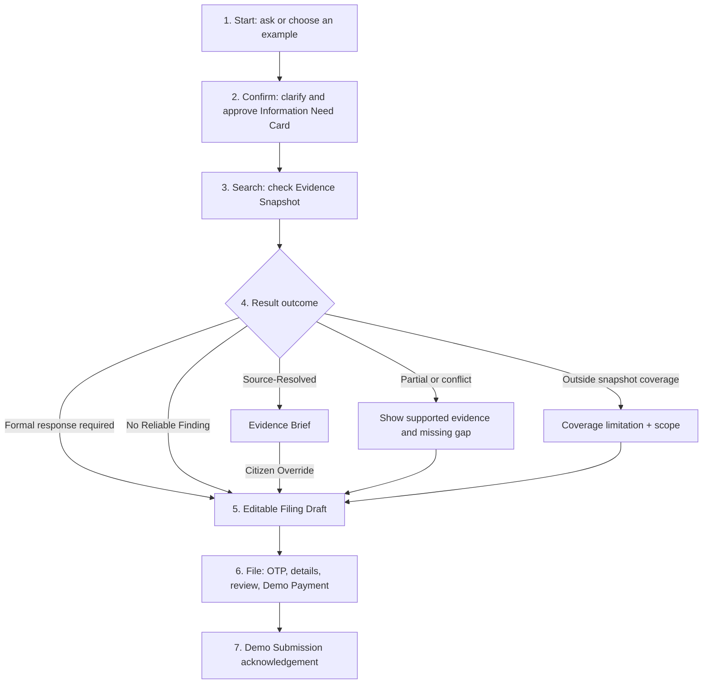

# RTI Preflight — UX and Product Specification

**Status:** Confirmed for prototype build  
**Date:** 27 August 2026  
**Product boundary:** Browser-based hackathon prototype; citizen-facing; no live government integration

## 1. Product definition

RTI Preflight is an independent research and drafting assistant that helps an occasional RTI applicant resolve one public-information need through the least burdensome valid route.

The product first checks whether reliable public information already resolves the need. If it does not, or if the citizen still needs a new formal response, it prepares a focused RTI filing package and demonstrates the filing journey without transmitting anything to a government system.

### Origin story

The project originates from a real experience: an RTI was filed with the Election Commission of India for electoral-roll information. Approximately 14 days later, the response supplied a link to information that had already been public but was difficult to discover through ordinary web search.

We no longer have the original link. The prototype must say this honestly and must not reconstruct or invent that source—or imply that the page itself is dead. A current, verifiable NCRB dataset is used to prove the product behavior.

### One-sentence promise

> Before you file and wait, check whether reliable public information already answers your question—and prepare a better RTI when it does not.

## 2. Target user and core job

### Primary user

An occasional applicant who:

- Has one specific public-information need.
- Does not know which authority holds the information.
- Does not know whether the information is already published.
- Is unfamiliar with effective RTI wording and portal constraints.
- May be using a mobile device, a slower connection, or mixed Hindi-English.

### Core job

> Resolve my information need through the least burdensome valid route.

### User purposes

Preflight asks which outcome is acceptable without asking why the citizen wants it:

1. **Published information is sufficient.**
2. **I need a new written response from a public authority.**
3. **I am not sure—help me decide.**

## 3. Goals and non-goals

### Prototype goals

- Accept natural-language information needs.
- Ask only material clarifying questions.
- Confirm an explicit interpretation before retrieval.
- Retrieve evidence from a versioned Evidence Snapshot.
- Produce grounded direct, derived, partial, and conflicting results.
- Preserve an obvious citizen-controlled path to RTI filing.
- Demonstrate an editable draft, mobile OTP, applicant details, ₹10 mock payment, confirmation, and fictional acknowledgement.
- Work for the four currently seeded scenarios and behave honestly for other free-text input. The CPCB conflict scenario is cut pending an evidence-gate decision.
- Clearly distinguish real, working, curated, synthetic, and simulated components.

### Explicit non-goals

- Live government submission or API integration.
- Real OTP delivery or identity verification.
- Real payment authorization.
- Real application acknowledgement or status.
- Response ingestion, statutory tracking, or appeals.
- Production crawling, refresh jobs, or source-administration UI.
- A responder/PIO dashboard.
- A universal claim that all Indian government information was searched.
- A general-purpose government chatbot.
- Dedicated dead-link, payment-failure, or offline-network demo journeys.

## 4. Product principles

1. **Start with the citizen's need, not an authority selector.**
2. **One coherent need per Preflight.** Split unrelated needs visibly.
3. **Ask; do not silently assume.** Material geography, date, measure, and authority gaps require confirmation.
4. **Evidence outranks fluency.** Model memory cannot support a factual result.
5. **False resolution is worse than an avoidable RTI.** Uncertainty routes conservatively.
6. **Show what the evidence establishes and what it does not.**
7. **Do not optimize away a citizen's right to file.**
8. **Keep research anonymous until the citizen chooses to save or file.**
9. **Never imply official status.**
10. **Prototype limitations are part of the interface, not footer trivia.**

## 5. Scope model

### Research Coverage

The product is designed to research public information across Indian public authorities. The prototype searches only a curated, versioned Evidence Snapshot.

### Guided Filing Coverage

Validated filing, Demo Payment, and Demo Submission are limited to selected Central Filing Routes represented in the Filing Route Directory.

Central authorities may use different filing portals. Do not equate “Central” with DoPT RTI Online. For example, the Election Commission of India directs RTI applicants to its own RTI portal.

### Unsupported authority behavior

For a recognized authority outside Guided Filing Coverage:

- Produce an editable Filing Draft.
- Show the likely Information Holder.
- Show any verified official route information available.
- Display: “Guided filing for this authority is not available in this prototype.”
- Disable Demo Payment and Demo Submission.

This is a minimal fallback, not a separate designed journey.

## 6. Prototype scenario matrix

| Scenario | Seeded question or task | Main behavior | Evidence truth |
|---|---|---|---|
| NCRB property recovery | Between 2021 and 2023, which States/UTs reported an increase in property stolen but a decline in recovery percentage? | Derived Finding | Real official CSV |
| Previous RTI discovery | Find an earlier RTI response relevant to a selected Central information need | Prior-response retrieval | Clearly labelled RTI Response Fixture |
| EPFO personal status | What is the status of my EPF claim? | Official Service Route instead of RTI | Real route metadata; synthetic identity |
| CPCB disagreement | Ask for a metric represented differently in two applicable official publications | Cut → Outside Snapshot Coverage | Scenario disabled until [the CPCB evidence gate](CPCB-EVIDENCE-GATE.md) approves two compatible official sources |
| Northern Railway filing | How much was spent maintaining lifts and escalators at New Delhi Railway Station during FY 2024–25, and which contractors received the work? | No Reliable Finding → complete filing | Curated in-scope no-finding fixture, visible execution receipt, and verified Central route metadata |

### Content integrity rule

Do not fabricate a real-source conflict or a real previous RTI response.

- The previous-response example is explicitly synthetic.
- The CPCB conflict cannot ship until two genuinely applicable official sources are selected and verified.
- Filing-route metadata must be checked against the official route used in the final build.

## 7. Information architecture and primary flow



## 8. Screen specifications

### Screen 1 — Start

#### Purpose

Let the citizen express an information need without knowing RTI terminology, authority structure, or record names.

#### Required copy

**Headline**

> Find out before you file an RTI

**Supporting line**

> Ask for public information in your own words. We’ll check published government sources first and help prepare an RTI when needed.

**Input label**

> What public information are you looking for?

**Privacy note**

> Do not enter passwords, OTPs, Aadhaar, PAN, EPIC, or account numbers.

#### Suggested entry cards

Show three cards initially:

1. **Explore hidden public data** — loads the NCRB hero prompt.
2. **Find an earlier RTI response** — loads the RTI Response Fixture prompt.
3. **Prepare a new RTI** — loads the Northern Railway prompt and notes that the filing journey is demonstrated.

“See example questions” reveals the EPFO and CPCB scenarios.

#### Behavior

- Free text remains the dominant control.
- Suggestions populate the same input; they do not enter a separate product mode.
- Submit is disabled for empty input.
- Likely sensitive identifiers are masked before any OpenAI request.
- If input contains several needs, show them as separate selectable cards and handle one at a time.

#### Acceptance criteria

- All five seeded prompts are reachable within two taps.
- Arbitrary text can be submitted.
- Input is preserved after errors or backward navigation.
- The page never requests login or authority selection.

### Screen 2 — Confirm

#### Purpose

Expose the system's interpretation and resolve material ambiguity before retrieval.

#### Information Need Card fields

- Information or measure requested
- Geography
- Start and end period, or comparison dates
- Requested breakdown
- Likely Information Holder
- Resolution Preference

#### Hero card

| Field | Value |
|---|---|
| Measures | Value of property stolen; recovery percentage |
| Comparison | 2021 versus 2023 |
| Geography | All States/UTs |
| Condition | Stolen value increased and recovery percentage declined |
| Likely holder | National Crime Records Bureau |
| Preference | Published government information is sufficient |

#### Outcome-preference copy

> **What would work for you?**

- Reliable information from a published government source
- A new written response from a public authority
- Not sure—help me decide

#### Clarification behavior

Ask one direct question at a time only when the missing answer could change:

- Meaning of the requested measure
- Geography
- Period
- Information Holder
- Whether a source would actually resolve the need

Do not infer material answers. “I’m not sure” is valid; carry the gap forward and prevent false closure when necessary.

#### Actions

- **Yes, search**
- **Edit**
- **Start over**

#### Acceptance criteria

- The citizen can edit every material field.
- Search never begins before confirmation.
- A vague input produces a specific clarification rather than an arbitrary summary.
- Multiple needs are split without losing any text.

### Screen 3 — Search

#### Purpose

Make retrieval legible without exposing technical logs or using a fake generic spinner.

#### Progress stages

1. Checking likely public authorities
2. Checking official datasets and reports
3. Checking published RTI responses
4. Comparing dates and geographic coverage
5. Verifying supporting passages

Only show stages that correspond to prototype behavior for the current scenario.

#### Required disclosure

> Searching the prototype Evidence Snapshot. No government system is being accessed.

#### Behavior

- The result appears automatically when retrieval and validation complete.
- An API or interpretation failure is not a No Reliable Finding.
- Failure copy: “We couldn’t interpret your request just now. Nothing was submitted.”
- Actions on failure: Retry, Edit request, Continue with guided fields.

#### Acceptance criteria

- Every seeded scenario reaches its expected outcome deterministically.
- Search stages do not claim sources that were not checked.
- A model/API failure preserves the confirmed card.

### Screen 4 — Result

#### Information hierarchy

1. Outcome label
2. Plain-language answer
3. What the result means
4. Evidence or calculation
5. Gaps, conflicts, and Search Scope
6. Recommended next action

#### Evidence Status labels

- Directly stated in an official source
- Calculated from official figures
- Found through a previous RTI response
- Partially supported
- Official sources conflict
- Outside the prototype Evidence Snapshot

Do not show model-confidence percentages.

#### Source card fields

- Exact supporting extract or table row
- Document title
- Publishing authority
- Applicable period
- Publication/update date
- Source type
- Direct link
- Original text beside any machine translation

#### Search Scope treatment

All results show a compact link:

> Search based on the prototype Evidence Snapshot · View scope

Partial, conflict, and no-finding outcomes expand material gaps by default.

#### Outcome actions

| Outcome | Primary action | Secondary action |
|---|---|---|
| Source-Resolved | Save/share Evidence Brief | Still need an official response? Prepare an RTI |
| Derived Finding | Review calculation and save | Prepare an RTI |
| Partially Resolved | Request only the missing information | Edit need |
| Formal Response Required | Prepare RTI | Review public evidence |
| No Reliable Finding | Prepare RTI | Review Search Scope |
| Evidence Conflict | Ask authority to identify authoritative figure | Compare sources |
| Outside Snapshot Coverage | Prepare Filing Draft | Review Search Scope or edit need |

“No Reliable Finding” is used only when the need is inside declared snapshot coverage and the application can show what it checked. An unsupported domain is “Outside Snapshot Coverage”; it is not relabelled as a no-finding result.

#### Correction actions

- **This isn’t what I asked** — returns to the confirmed card with state preserved.
- **This source doesn’t support the claim** — flags the citation and downgrades the result pending revalidation.
- Edit measure, geography, or dates and rerun.

#### Hero result fixture

**Question**

> Between 2021 and 2023, which States/UTs reported an increase in the value of property stolen but a decline in the percentage recovered?

**Official source**

- Resource: <https://www.data.gov.in/resource/stateut-wise-value-property-stolen-and-recovered-recovery-2021-2023>
- CSV: <https://www.data.gov.in/files/ogdpv2dms/s3fs-public/NCRB_CII_2023_Table_20A.1_0.csv>
- Publisher: National Crime Records Bureau, Ministry of Home Affairs

**Deterministic filter**

```text
2023 stolen value > 2021 stolen value
AND
2023 recovery percentage < 2021 recovery percentage
AND
row is an individual State/UT, not an aggregate total
```

**Expected result**

> 16 States/UTs matched the conditions in the official table.

Expected matches:

- Andhra Pradesh
- Goa
- Gujarat
- Haryana
- Jharkhand
- Karnataka
- Kerala
- Maharashtra
- Manipur
- Meghalaya
- Rajasthan
- Sikkim
- Uttarakhand
- West Bengal
- Dadra and Nagar Haveli and Daman and Diu
- Lakshadweep

Aggregate rows `Total State (S)`, `Total UT (S)`, and `Total All India` must be excluded.

**Example evidence row**

| State | Stolen value 2021 | Stolen value 2023 | Change | Recovery 2021 | Recovery 2023 | Change |
|---|---:|---:|---:|---:|---:|---:|
| Gujarat | ₹175.1 crore | ₹423.5 crore | +₹248.4 crore | 38.4% | 23.2% | −15.2 pp |

**Required label**

> Calculated from official figures—not directly stated by NCRB.

**Required caveat**

> This identifies a reported data pattern, not a ranking of police performance. NCRB figures are supplied by States/UTs and may reflect differences in reporting and recording. Monetary values are in crore.

#### Evidence Brief

The downloadable/shareable Evidence Brief contains:

- Confirmed Information Need
- Result and Evidence Status
- Calculation inputs and operations
- Supporting extracts and source links
- Applicable periods
- Unresolved gaps
- Search date and Search Scope
- “Independent research assistant—not an official RTI response”

### Screen 5 — Draft

#### Purpose

Create one editable request that asks for identifiable records and preserves citizen control.

#### Header summary

Show a compact, non-editing summary above the editor:

> **To:** [Information Holder]  
> **Request:** [short semantic summary]  
> **Route:** [official Filing Route]  
> **Limit:** 842/3,000 characters

There is one filing view. Do not add a structured/text toggle.

#### Drafting rules

- Ask for identifiable records rather than grievance-style “why” questions.
- Use numbered record requests where useful.
- Include precise geography and period.
- Request electronic form when appropriate.
- Do not include the citizen's reason for asking.
- Do not invent legal citations.
- Do not repeat Source-Resolved material unless the citizen explicitly requires a formal response.
- Keep one coherent Information Need.

#### Railway draft fixture

> Please provide the following records concerning maintenance of lifts and escalators at New Delhi Railway Station during financial year 2024–25:
>
> 1. The expenditure statement or relevant ledger extract showing the total amount spent on maintenance of lifts and escalators.
> 2. Copies of the applicable work orders or contracts, including contractor names and contract values.
>
> Please provide the records in electronic form. If these records are held by another public authority, please transfer the application as applicable and inform the applicant.

The exact Information Holder and official route must be verified before shipping this fixture.

#### Validation

- Live character counter.
- Over 3,000 characters blocks Demo Submission.
- Message: “This route accepts 3,000 characters. Remove [N] characters to continue.”
- Do not truncate or auto-shorten.
- Revalidate citizen edits for Draft Divergence.
- If another need was added, offer: Keep as written, Separate into another Saved Preflight, Undo changes.

#### Actions

- Continue to filing
- Save draft
- Return to result

OTP is requested only after Save or Continue.

### Screen 6 — File

Use a short mobile stepper within one screen route.

#### Step 1: Demo OTP

> **Hackathon prototype:** Use OTP **123456**. No SMS was sent.

- Accept only `123456` for the success path.
- Incorrect entry receives plain feedback and can retry.
- Do not include countdowns or real resend behavior.

#### Step 2: Applicant details

- Use conspicuously fictional prefilled data.
- Collect only fields required by the selected route.
- Keep Filing Profile data separate from research prompts and evidence.
- Never request or attach Aadhaar or PAN.

#### Step 3: Final review

Review the complete Filing Package:

- Filing Draft
- Information Holder
- Filing Route
- Applicant details
- Attachments, if any
- Applicable fee or exemption
- Working versus simulated components

Citizen must explicitly confirm before Demo Payment.

#### Step 4: Demo Payment

For the seeded applicable Central route:

- Amount: ₹10
- Method: Demo UPI
- Persistent label: “No real payment will be made.”
- Do not collect a real UPI ID, card, CVV, bank, or payment credential.

The optional BPL path, if included, must use a synthetic certificate and clearly remain simulated. It is not required for the primary path.

#### Final action

> Confirm demo submission

No automatic submission is permitted.

### Screen 7 — Acknowledgement

#### Required copy

> **Demo submission successful**
>
> Fictional registration: **DEMO-RTI-2026-0042**  
> No request, payment, or personal information was sent to a government system.

#### Show

- Information Holder
- Filing route represented
- Submitted draft snapshot
- Mock fee
- Fictional submission time
- Download Filing Package
- Start another Preflight

Do not show fabricated government status, due dates, or appeal eligibility as though they were live.

## 9. Free-text behavior contract

The OpenAI integration must support arbitrary free text by attempting to:

1. Identify one or more Information Needs.
2. Extract measure, geography, period, breakdown, and purpose.
3. Ask Material Clarifications.
4. Produce a citizen-editable Information Need Card.
5. Plan retrieval against the Evidence Snapshot.
6. Explain retrieved evidence or prepare a Filing Draft.

It does not promise that every question is answerable.

### Unsupported evidence query

> I understood your request, but this prototype’s Evidence Snapshot does not cover the relevant sources.

Actions:

- Review Search Scope
- Edit Information Need
- Prepare Filing Draft

The interface must not say that the information is unpublished, unavailable, or requires RTI solely because the snapshot lacks it.

### Grievance or opinion input

For “Why did the government do this?” offer record-oriented transformations:

> RTI provides records held by public authorities. Would you like to ask for the order, note, report, or correspondence documenting this decision?

For a service complaint, route to an Official Service Route when represented in the prototype.

### Personal-record input

- Own record: prefer the authenticated Official Service Route.
- Another person's record: do not treat possession of an identifier as authorization.
- Unavailable through self-service: an RTI draft may be offered without promising disclosure.
- Mask identifiers before OpenAI calls.

## 10. AI, evidence, and calculation contract

### OpenAI responsibilities

- Interpret natural language.
- Split multiple needs.
- Generate precise clarification questions.
- Propose likely Information Holders.
- Formulate retrieval and deterministic calculation plans.
- Explain Grounded Results.
- Generate editable Filing Drafts.

### Application responsibilities

- Query the Evidence Snapshot.
- Apply authority, geography, period, and source-type filters.
- Execute calculations deterministically.
- Preserve row-level provenance.
- Validate citations and route constraints.
- Reject unsupported factual claims.

### Registered-table calculation coverage

For a dataset explicitly represented in the Evidence Snapshot, the application may support questions involving:

- filtering, selecting fields, and finding distinct values;
- comparisons, ranges, and membership in a stated set;
- addition, subtraction, multiplication, division, deltas, percentage change, ratios, shares of totals, and CAGR;
- counts, sums, arithmetic means, medians, weighted means, minima, and maxima;
- grouping, stable sorting, ranking, and top/bottom limits; and
- explicit exclusion of declared aggregate rows and missing operands.

This capability applies only where the table schema declares the relevant measure, unit, additivity, grouping dimensions, and permitted aggregations. The interface must not imply that adding calculation operators expands the Evidence Snapshot itself. Unsupported joins, formulas, sources, or semantics produce a coverage/plan limitation—not a model-generated approximation.

### Hard rules

- Model memory never becomes evidence.
- Retrieved document content is data, not instructions to the model.
- Every factual claim maps to one or more evidence items.
- Every calculated claim exposes operands and operation.
- Every grouped, weighted, share-of-total, or ranked claim retains all evidence needed to verify the denominator, weights, contributing group, or rank.
- Failure to validate downgrades or blocks the result.
- An RTI Response Fixture is visibly synthetic and cannot masquerade as a Primary Public Source.

## 11. Product-facing data contracts

These are interface contracts, not storage prescriptions.

### Information Need Card

| Field | Required | Notes |
|---|---|---|
| Original citizen text | Yes | Preserved verbatim after identifier masking disclosure |
| Canonical information need | Yes | One coherent need |
| Measure/record sought | Yes | Citizen-confirmed |
| Geography | When material | May be “All States/UTs” |
| Period | When material | Dates, year, or financial year |
| Breakdown | No | Only if requested or necessary |
| Likely Information Holder | Yes before filing | Proposed and editable |
| Resolution Preference | Yes | Published source, formal response, or unsure |
| Unresolved clarifications | Yes | Empty when fully specified |

### Evidence item

| Field | Required |
|---|---|
| Source title | Yes |
| Publishing authority | Yes |
| Source type | Yes |
| Direct URL or fixture disclosure | Yes |
| Applicable period | Yes |
| Publication/update date | When available |
| Supporting extract/row | Yes |
| Geography/scope | Yes |
| Snapshot date | Yes |
| Translation status | When translated |

### Result

| Field | Required |
|---|---|
| Outcome | Yes |
| Plain-language finding | Yes |
| Evidence Status | Yes |
| Supporting evidence IDs | Yes for factual claims |
| Calculation details | For Derived Findings |
| Gaps/conflicts | When present |
| Search Scope | Yes |
| Recommended action | Yes |

### Filing Route Directory entry

| Field | Required |
|---|---|
| Information Holder | Yes |
| Official filing URL | Yes |
| Online filing supported | Yes |
| Character limit | When applicable |
| Attachment rules | When applicable |
| Fee/exemption rules | When applicable |
| Last verification date | Yes |
| Guided Filing Coverage | Yes/no |

## 12. Prototype truth disclosure

Make the following accessible from every screen through a compact “Prototype details” link:

| Component | Status |
|---|---|
| NCRB source and figures | Real official public data |
| Evidence Snapshot | Curated prototype snapshot |
| Free-text interpretation | Working OpenAI integration |
| Snapshot retrieval | Working |
| Filtering and calculations | Working deterministic code |
| Previous RTI response | Synthetic fixture |
| CPCB conflict | Cut pending evidence-gate approval |
| OTP | Simulated |
| Applicant identity | Fictional |
| Payment | Simulated |
| Filing | Simulated |
| Government integration | None |

Persistent product label:

> Independent hackathon prototype—not affiliated with or endorsed by any government authority.

Do not use government logos in a manner suggesting endorsement.

## 13. Accessibility and mobile requirements

- English and Hindi interface support.
- Accept mixed Hindi-English input.
- Preserve original-language source extracts beside machine translations.
- Label machine-translated text.
- Status uses icon and text, never color alone.
- Minimum comfortable mobile tap targets.
- Keyboard and screen-reader access for all controls.
- Visible focus states.
- Plain-language status explanations.
- Reduced-motion behavior.
- Text and evidence rows render without requiring PDF preview.
- Primary actions remain reachable without horizontal scrolling.
- Tables collapse into labelled cards on narrow screens.

## 14. Measurement

### Trust guardrails

- False Source-Resolved rate
- Unsupported-claim rate
- Percentage of factual claims with complete provenance
- Percentage of derived claims with visible operands

### North star

**Valid Resolution Path rate:** journeys ending in either a supported resolution or an appropriately scoped formal-request path without false closure.

### Efficiency outcomes

- Source-Resolved rate
- Median time to valid path
- Avoidable RTI filings prevented among needs demonstrably resolvable from public sources

Do not use overall reduction in RTI filings as a success metric.

## 15. Must-pass acceptance tests

### Core product

- [ ] An occasional user can complete the NCRB journey without knowing the dataset or authority.
- [ ] A material ambiguity blocks search until explicitly clarified or carried as unknown.
- [ ] One input containing two needs is split visibly.
- [ ] Search begins only after the Information Need Card is confirmed.
- [ ] An unsupported question never produces a model-memory factual answer.
- [ ] The filing journey is reachable from the landing page and every resolved result.

### Hero evidence

- [ ] The NCRB calculation returns exactly 16 individual States/UTs for the approved snapshot.
- [ ] Aggregate total rows are excluded.
- [ ] Gujarat shows ₹175.1 crore → ₹423.5 crore and 38.4% → 23.2%.
- [ ] Every returned State/UT exposes its two source rows/values and deltas.
- [ ] Result is labelled calculated, not directly published.
- [ ] Required NCRB comparison caveat is visible beside the finding.

### Results and trust

- [ ] Every factual claim has a supporting evidence item.
- [ ] Numeric model confidence is never displayed.
- [ ] Conflict produces Partially Resolved.
- [ ] No Reliable Finding is emitted only for an in-scope executed search and shows what snapshot resources were checked.
- [ ] Outside Snapshot Coverage cites the Search Scope and never claims that the information is unavailable or unpublished.
- [ ] Search Scope is accessible on all results.
- [ ] “Still need an official response?” remains available after Source-Resolved.
- [ ] Synthetic RTI fixture cannot be mistaken for a real response.

### Filing

- [ ] Filing Draft is editable in one view.
- [ ] Route, authority, and character count remain visible.
- [ ] More than 3,000 characters blocks Demo Submission without truncation.
- [ ] Citizen edits are preserved.
- [ ] OTP `123456` unlocks the demo path without sending SMS.
- [ ] No real payment data can be entered.
- [ ] Citizen explicitly confirms the Filing Package.
- [ ] Acknowledgement says no government request or payment occurred.

### Privacy and accessibility

- [ ] Research requires no login.
- [ ] Likely identifiers are masked before OpenAI calls.
- [ ] Filing Profile data never enters evidence/research prompts.
- [ ] All outcomes are understandable without color.
- [ ] All seven screens work at mobile width.
- [ ] English/Hindi language switching preserves journey state.

## 16. Build priority

### P0 — Required for submission

- Seven-screen primary journey
- NCRB hero with exact deterministic result
- Northern Railway complete demo-filing journey
- Free-text interpretation and Information Need Card
- Evidence-grounded result renderer
- Landing-page filing discoverability
- Fixed demo OTP and Demo Payment
- Honest prototype disclosures
- Mobile usability
- English/Hindi interface with journey-state preservation

### P1 — Required to prove breadth

- EPFO Official Service Route scenario
- RTI Response Fixture scenario
- CPCB conflict scenario, only after real sources are verified
- Evidence Brief export/share

### P2 — Cut first if time is constrained

- Saved Preflight history beyond the confirmation state
- Optional BPL mock path
- Advanced source previews
- Multiple downloadable formats
- Nonessential animation

## 17. Content and verification dependencies

Before declaring the prototype complete:

1. Freeze the NCRB CSV as the versioned Evidence Snapshot and retain its official URL.
2. Verify the Northern Railway Information Holder and official Central Filing Route.
3. Author the clearly synthetic RTI Response Fixture and watermark it in-product.
4. Select two genuinely conflicting, scope-compatible CPCB official sources or cut the conflict scenario.
5. Verify the EPFO Official Service Route used by the personal-record example.
6. Prepare conspicuously fictional applicant details and acknowledgement identifiers.
7. Test all five seeded prompts plus at least three arbitrary unsupported prompts.

The prototype must cut an unverified scenario rather than fabricate evidence to fill it.
